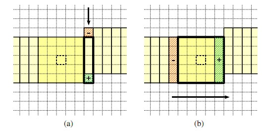

# 滤波概述
+   https://www.cnblogs.com/wj-1314/p/11693364.html
+   https://blog.csdn.net/shandianfengfan/article/details/109571392
+   https://github.com/egonSchiele/OpenCV/blob/master/modules/imgproc/src/smooth.cpp
+   https://os.mbed.com/teams/Renesas-GR-PEACH-OpenCV-Development/code/gr-peach-opencv-project-sd-card_update/docs/tip/smooth_8cpp_source.html

WHAT IS MEDIAN BLUR?

思考:
1、OpenCV划分不同kernel的根本原因，既然有O(1)的算法为什么不统一进行计算？
2、8uOm算法为什么不使用指令集优化？
3、算法接口流程图
4、硬件支持的判定
5、8uO1的实现原理，涉及CPUcache的缓存容量
6、图像的行循环、列循环遍历原因

#   快速中值滤波

### 原理

不同的kernel大小对应的不同的滤波方式3X3 和 5X5 采用核展开的形式进行比较;同时根据图像大小，设置动态kernel阈值，分别使用两种方式进行滤波，算法复杂度分别为O(m), O(1),其中m表示kernelsize

+   __3×3 原理__
```
I0 I1 I2
I3 I4 I5
I6 I7 I8
```
step1： 分别对三行进行比较排序，得到

I0 < I1 < I2
I3 < I4 < I5
I6 < I7 < I8

step2:  分别对第一列和第三列进行部分排序，即比较两次

（1）将第一列最大数交换到I6所在位置
I0 > I3,swap(I0,I3) 
I3 > I6,swap(I3,I6)
此时由于I0/I3 在第一列表明已经小于两个数，同时小于I6,表明，再次小于三个数，所以不可能成为中位数

（2）将第三列最小数交换到I2所在位置
I5 < I2, swap(I2,I5)
I8 < I2, swap(I8,I2)
由于I2 < I5, I2 < I8, 由于2/5/8在第三列，同时大于两个数，则I5/I8
大于5个数，不可能成为中位数

step3： 斜对角元素排列
对I2,I4,I6进行全排序，则I4位置所在的数为中位数


+ __5*5原理__

+ __medianBlur8uOm 算法复杂度O(m)__

构建两个直方图进行中值查找，分别为zone0[4][16] 和zone1[4][16*16],其中4表示图像的最大通道，16表示[0,256]的16次划分，16×16表示[0,256]的256次划分
列遍历查找过程
    图像边界replicated kernel/2 
    for x in width
        for y in height
            x 偶数情况
                [x,y]为中心， [m/2, m] 范围初始化zone（y=0，边界默认采用replicated，所以每个边界点的值 +（m/2+1); zone中必须记录满m^2个数）
                通过调整sptr_top / sptr_bottom, 动态的增加和删减zone中的值并通过累计zone0和zone1的方式来获取中值 最多计算32次

        
+   __medianBlur8u01 算法复杂度O(1)__

O(1)复杂度实现示意图


paper: Median Filtering in Constant Time 

在复杂度O(m)的算法中，每横向移动一个像素，都需要在直方图最右侧和最左侧加上和减去像素，并没有充分利用行像素的不变性。考虑保留行像素的算法核心流程如下：
```
Input:Image X of size m X n, kernel_radius r
Output: Image Y of same size
    Init kernel histogram H(256bins，统计m^2像素)
    Init column hitograms h1/h2/../hn, h1统计第一列 列方向m个像素的直方图统计信息
    for i = 1 to m do
        for j = 1 to n do
            Remove X(i-r-1, j+r) from h(j+r)
            Add X(i+r,j+r) to h(j+r)
            H <- H + h(j+r) - h(j-r-1)
        end for
    end for
```

8位灰度图的OP如下
```
    “+”  1    更新top right histogram
    “-”  1    更新bottom right histogram
    “+”  256  kernel histogram 新增 最右侧 h
    “-”  256  kernel histogram 减去 最左侧 h
    “cmp” "+" 查找中值 平均情况 127 “+” 128 “cmp” 
```

针对上述OP，可以便捷的采用并行化加速提高运算速度和降低执行次数


### 特殊情况处理说明
+   w==1 或 h==1情况，由于比较数量降低到3,需要进行单独处理
三通道举例

[1，2,3] [4,5,6] [7,8,9]
```
    cn                                  -- channel
    sstep                               -- 每行像素个数，像素对齐，可能大于实际像素数
    sdelta                              -- 当只有一行的情况，表示通道数;当只有一列的情况，表示每行的像素数;
    ddelta                              -- 同上
    sdelta0 = h == 1 ? 0 : sstep - cn;  -- 考虑字节对齐，如[1，2,3] [4,5,6] [7,8,9]，考虑4字节对齐，在只有一列的情况下，[1,2,3,_],为了让指针能够指到下一行，需要进行+1，弥补 _ 
    for (i = 0; i < len; i++, sptr += sdelta0, dptr += ddelta) 
        for (j = 0; j < cn; j++, sptr++)
        {
            WT p0 = sptr[i > 0 ? -sdelta : 0];      //边界坐标访问 一行情况下 若当前ptr指向1,则 p0 = 1, p1 = 1, p1=4 ; 若 ptr指向5, 则p0=2,p1=5,p2=8  
                                                    //           一列情况下 若当前ptr指向1,则 p0 = 1, p1 = 1, p1=4 ; 若 ptr指向5, 则p0=2,p1=5,p2=8  
            WT p1 = sptr[0];                        //
            WT p2 = sptr[i < len - 1 ? sdelta : 0]; //防止越界的处理方法

            op(p0, p1); op(p1, p2); op(p0, p1);
            dptr[j] = (T)p1;
        }
```

+   swap(a,b)，当a < b 交换a、b的实现
```
//一般情况
#define  swap(a,b) \
        if(a < b){\
            tmp = a; \
            a = b; \
            b = tmp; \
        }  \
```


滤波函数，包含高斯滤波
https://blog.csdn.net/songzitea/article/details/52204423


### 关于define
define定义函数的使用场景和优缺点
+   小功能，避免使用函数造成的额外开销 #define MAX(a,b) ((a)>(b)?(a):(b))
+   无法使用函数实现的功能，比如需要传入数据类型，用于申请内存 
```
#define Malloc(n,type)\
  (type*)malloc(n*sizeof(type)) \

```

### 图像首末行特殊处理的循环
method_1：
```
行遍历
    int limits
    

```
method_2：
```
    列遍历卷积的标准写法
    1、边缘越界
    2、边界值的处理
    3、

```


### 限定范围两个数的快速交换写法
```

```

### 静态成员函数的作用
+   只在当前文件中可见