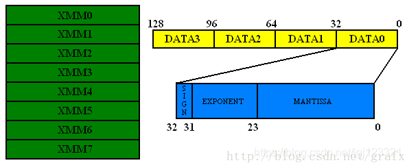
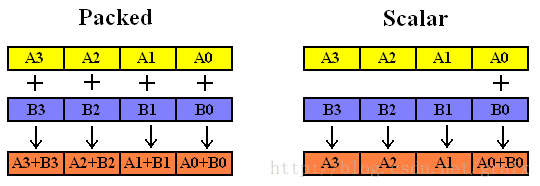
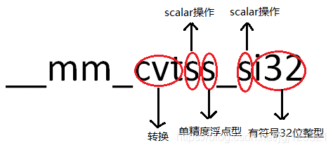

## 补充概念和基础
###   指令集概念
SIMD -- Single Instruction Multiple Data 单指令多数据技术，支持MMX，SSE，AVX
SSE2 -- streaming SIMD Extensions 2, 数据流单指令多数据扩展
        sse提供8个128bit的寄存器进行SIMD操作

8个128位寄存器，xmm0-xmm7,每个寄存器可以存储4个32位单精度浮点数或8个16位整形数，sse的所有计算一次性针对一个寄存器的数据进行计算,从而带来效率提升。

###   指令集使用
####  一般使用方式
+   方式1：内嵌汇编
+   方式2：使用SSE指令集的内联函数,使用过程中会展开为汇编

```
头文件
#include <mmintrin.h>   //mmx
#include <xmmintrin.h>  //sse
#include <emmintrin.h>  //sse2
#include <pmmintrin.h>  //sse3
```
#### 指令集组成（TODO，解释不够清晰）
+   part 1
    _mm  -- 表示多媒体扩展指令集，即sse指令集
+   part 2
    _add -- 指令操作类型 ，其它如 _mul
+   part 3
    _p   -- 对变量的处理方式，p表示packaged，对寄存器中的每个元素进行计算，s表示scalr，支队第一个元素进行计算  p/s
    s/d/i32 -- 表示参与运算的数据类型 s-32位浮点数，d-64位浮点数 i32-带符号32整型 i64表示带符号64位整型 u32 屋敷号32位整型 



#### SSE的数据类型
__m128 -- 单精度浮点数 16个字节，等于4个浮点数
__m128d -- 双精度浮点数 
__m128i -- 整形 union共用体

```
typedef union __declspec(intrin_type)_CRT_ALIGN(16)__m128i {
	__int8                m128i_i8[16];  //char
	__int16               m128i_i16[8];  //short
	__int32               m128i_i32[4];  //int
	__int64               m128i_i64[2];  //long long
	unsigned __int8       m128i_u8[16];  //uchar
	unsigned __int16      m128i_u16[8];  //ushort
	unsigned __int32      m128i_u32[4];  //uint
	unsigned __int64      m128i_u64[2];  //ulonglong
}__m128i;
```
#### 常用SSE指令 
+   load 数据加载 *注意字节对齐
```
__m128  _mm_load_ss(float *p) //将一个单精度浮点数加载到寄存器的第一个字节，其它三个字节清零（r0 := *p, r1 := r2 := r3 := 0.0）
__m128  _mm_load_ps(float *p) //将四个单精度浮点数加载到寄存器（r0 := p[0], r1 := p[1], r2 := p[2], r3 := p[3]）
__m128  _mm_load1_ps(float *p)//将p地址的值加载到暂存器的四个字节，需要多条指令完成。从性能考虑，在内层循环不要使用这类指令（r0 := r1 := r2 := r3 := *p）
__m128  _mm_loadh_pi(__m128 a, __m64 *p)//
__m128  _mm_loadl_pi(__m128 a, __m64 *p)//
__m128  _mm_loadr_ps(float *p)//以_mm_load_ps反向的顺序加载，需要多条指令完成。（r0 := p[3], r1 := p[2], r2 := p[1], r3 := p[0]） 
__m128  _mm_loadu_ps(float *p)//_mm_load_ps一样的加载，但是不要求地址是16字节对齐
```
+   set 
```
__m128 _mm_set_ss(float w)//对应于_mm_load_ss的功能，不需要字节对齐，需要多条指令（r0 = w, r1 = r2 = r3 = 0.0）
__m128 _mm_set_ps(float z, float y, float x, float w)//对应于_mm_load_ps的功能，参数是四个单独的单精度浮点数，所以也不需要字节对齐，需要多条指令。（r0=w, r1 = x, r2 = y, r3 = z，注意顺序）
__m128 _mm_set1_ps(float w)//对应于_mm_load1_ps的功能，不需要字节对齐，需要多条指令。（r0 = r1 = r2 = r3 = w）
__m128 _mm_setr_ps(float z, float y, float x, float w)//对应于_mm_loadr_ps功能，不需要字节对齐，需要多条指令。（r0=z, r1 = y, r2 = x, r3 = w，注意顺序）
__m128 _mm_setzero_ps()//清0操作，只需要一条指令。（r0 = r1 = r2 = r3 = 0.0）
```

+  store，将sse寄存器中的数据保存到内存中，反向数据传递
```
void _mm_store_ss(float *p, __m128 a)  //一条指令，*p = a0
void _mm_store_ps(float *p, __m128 a)  //一条指令，p[i] = a[i]
void _mm_store1_ps(float *p, __m128 a) //多条指令，p[i] = a0
void _mm_storeh_pi(__m64 *p, __m128 a) //
void _mm_storel_pi(__m64 *p, __m128 a) //
void _mm_storer_ps(float *p, __m128 a) //反向，多条指令
void _mm_storeu_ps(float *p, __m128 a) //一条指令，p[i] = a[i]，不要求16字节对齐
void _mm_stream_ps(float *p, __m128 a) //直接写入内存，不改变cache的数据
```

+   计算
```
__m128 _mm_add_ss (__m128 a, __m128 b)
__m128 _mm_add_ps (__m128 a, __m128 b)

```
+   数据类型转换 
```
__mm_cvtss_si32   //单精度浮点数转换为有符号32位整数
__mm_cvttss_si32  //单精度浮点数转换为有符号32位整数（带截断操作）
__mm_cvtpi16_ps   //16位有符号整数转换为单精度浮点数
```


####   使用步骤
+   load/set 加载数据到寄存器
+   sse指令完成计算
+   store函数将结果从寄存器取出到内存

####  使用案例
https://blog.csdn.net/jgj123321/article/details/95633431

部分
|内部 |指令  |操作
|:---|:----|:----|
|_mm_add_epi8|PADDB|加
|_mm_add_epi16|PADDW|加
|_mm_add_epi32|PADDD|_mm_add_si64

参考链接：
https://blog.csdn.net/laobai1015/article/details/78678801?utm_source=blogxgwz9


#### SIMD调试方法
